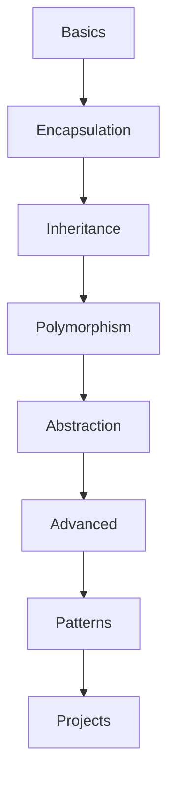

# Object-Oriented Programming in C++ - Learning Repository

Welcome to your comprehensive OOP learning journey! This repository is structured to take you from basic OOP concepts to advanced design patterns and real-world projects.

## 📚 Repository Structure

```bash
oops/
├── 01_basics/                 # Fundamental OOP concepts
├── 02_encapsulation/          # Data hiding and access control
├── 03_inheritance/            # Code reuse and class hierarchies
├── 04_polymorphism/           # Runtime and compile-time polymorphism
├── 05_abstraction/            # Abstract classes and interfaces
├── 06_advanced_concepts/      # Modern C++ and advanced OOP
├── 07_design_patterns/        # Common design patterns
└── 08_projects/               # Complete projects combining all concepts
```

## 🎯 Learning Goals

Each section builds upon previous concepts, ensuring a solid understanding of OOP principles and their practical applications.

---

## 📖 Section Details

### 01_basics/ - Foundation Concepts

#### `class_and_object.cpp`

**Goal**: Master the fundamental building blocks of OOP
**Problem Statement**: Create a Student class that encapsulates student data and behavior

- **What you'll learn**: Class definition, object creation, member variables, member functions
- **Challenge**: Implement a complete Student class with proper data management
- **Real-world connection**: Understanding how real-world entities become software objects

#### `constructor_destructor.cpp`

**Goal**: Understand object lifecycle and initialization
**Problem Statement**: Create a BankAccount class with multiple initialization methods

- **What you'll learn**: Default constructors, parameterized constructors, copy constructors, destructors
- **Challenge**: Properly manage object creation and cleanup
- **Real-world connection**: How objects are born and destroyed in memory

#### `static_members.cpp`

**Goal**: Distinguish between class-level and instance-level data
**Problem Statement**: Build a Counter class that tracks total instances

- **What you'll learn**: Static variables, static methods, class vs instance scope
- **Challenge**: Share data across all instances of a class
- **Real-world connection**: Global state management and class-wide properties

#### `friend_function.cpp`

**Goal**: Understand controlled access to private members
**Problem Statement**: Create a Rectangle class with external area calculation

- **What you'll learn**: Friend functions, friend classes, breaking encapsulation safely
- **Challenge**: Allow external access while maintaining design integrity
- **Real-world connection**: Trusted external components accessing internal data

### 02_encapsulation/ - Data Protection

#### `data_hiding.cpp`

**Goal**: Implement proper data protection mechanisms
**Problem Statement**: Design an Employee class with secure salary management

- **What you'll learn**: Access specifiers (private, protected, public), data validation
- **Challenge**: Protect sensitive data while providing necessary access
- **Real-world connection**: Security and data integrity in software systems

#### `getter_setter.cpp`

**Goal**: Provide controlled access to private data
**Problem Statement**: Create a Product class with validated price and stock management

- **What you'll learn**: Accessor methods, mutator methods, input validation
- **Challenge**: Balance accessibility with data protection
- **Real-world connection**: API design and data validation in applications

#### `class_invariants.cpp`

**Goal**: Maintain object state consistency
**Problem Statement**: Build a Date class that always represents valid dates

- **What you'll learn**: Class invariants, state validation, defensive programming
- **Challenge**: Ensure object state remains valid throughout its lifetime
- **Real-world connection**: Data integrity and error prevention

### 03_inheritance/ - Code Reuse

#### `single_inheritance.cpp`

**Goal**: Create hierarchical relationships between classes
**Problem Statement**: Model a vehicle hierarchy with shared and specific properties

- **What you'll learn**: Base classes, derived classes, method inheritance, constructor chaining
- **Challenge**: Design a clean inheritance hierarchy
- **Real-world connection**: Modeling real-world categorical relationships

#### `multiple_inheritance.cpp`

**Goal**: Combine behaviors from multiple sources
**Problem Statement**: Create a Duck class that can both fly and swim

- **What you'll learn**: Multiple base classes, naming conflicts, interface combination
- **Challenge**: Manage complexity of multiple inheritance
- **Real-world connection**: Objects with multiple capabilities or roles

#### `multilevel_inheritance.cpp`

**Goal**: Build extended inheritance chains
**Problem Statement**: Model Animal → Mammal → Dog relationship

- **What you'll learn**: Inheritance chains, method overriding, property propagation
- **Challenge**: Design deep inheritance hierarchies effectively
- **Real-world connection**: Complex taxonomic or organizational structures

#### `diamond_problem.cpp`

**Goal**: Resolve inheritance ambiguities
**Problem Statement**: Create a TeachingAssistant that is both Student and Teacher

- **What you'll learn**: Diamond inheritance problem, virtual inheritance, ambiguity resolution
- **Challenge**: Handle complex inheritance scenarios
- **Real-world connection**: Multiple role scenarios in organizations

### 04_polymorphism/ - Dynamic Behavior

#### `function_overloading.cpp`

**Goal**: Provide multiple interfaces for similar operations
**Problem Statement**: Create a Calculator with operations on different data types

- **What you'll learn**: Compile-time polymorphism, function signatures, type resolution
- **Challenge**: Design intuitive overloaded interfaces
- **Real-world connection**: API flexibility and ease of use

#### `operator_overloading.cpp`

**Goal**: Make custom classes behave like built-in types
**Problem Statement**: Implement a Complex number class with mathematical operations

- **What you'll learn**: Operator overloading, intuitive syntax, type integration
- **Challenge**: Create natural and intuitive operator behaviors
- **Real-world connection**: Mathematical libraries and domain-specific languages

#### `virtual_functions.cpp`

**Goal**: Achieve runtime polymorphism
**Problem Statement**: Create a Shape hierarchy with dynamic method dispatch

- **What you'll learn**: Virtual functions, dynamic binding, runtime polymorphism
- **Challenge**: Design flexible polymorphic interfaces
- **Real-world connection**: Plugin systems and extensible architectures

#### `abstract_classes.cpp`

**Goal**: Define contracts and interfaces
**Problem Statement**: Create drawing interfaces that enforce implementation

- **What you'll learn**: Pure virtual functions, abstract classes, interface design
- **Challenge**: Design abstract interfaces that guide implementation
- **Real-world connection**: Framework design and architectural contracts

### 05_abstraction/ - Interface Design

#### `abstract_data_types.cpp`

**Goal**: Hide implementation complexity behind simple interfaces
**Problem Statement**: Implement a Stack ADT with hidden internal structure

- **What you'll learn**: Data abstraction, interface design, implementation hiding
- **Challenge**: Create powerful yet simple interfaces
- **Real-world connection**: Library design and API development

#### `interfaces.cpp`

**Goal**: Define behavioral contracts
**Problem Statement**: Create Printable and Comparable interfaces for multiple classes

- **What you'll learn**: Interface segregation, contract programming, multiple interfaces
- **Challenge**: Design minimal, focused interfaces
- **Real-world connection**: Protocol design and system integration

#### `data_abstraction.cpp`

**Goal**: Separate concerns and hide complexity
**Problem Statement**: Create a Database abstraction layer

- **What you'll learn**: Layered architecture, abstraction levels, complexity management
- **Challenge**: Hide complex implementation behind simple interfaces
- **Real-world connection**: System architecture and separation of concerns

### 06_advanced_concepts/ - Modern C++ and Advanced OOP

#### `raii.cpp`

**Goal**: Master automatic resource management
**Problem Statement**: Create self-managing resource handlers

- **What you'll learn**: RAII pattern, automatic cleanup, exception safety
- **Challenge**: Ensure resources are always properly managed
- **Real-world connection**: Memory management and system resource handling

#### `exception_handling.cpp`

**Goal**: Handle errors gracefully in OOP systems
**Problem Statement**: Build robust error handling for object operations

- **What you'll learn**: Exception hierarchies, exception safety, error propagation
- **Challenge**: Create resilient object-oriented systems
- **Real-world connection**: Robust application development

#### `templates.cpp`

**Goal**: Write generic, reusable code
**Problem Statement**: Create type-safe, reusable container classes

- **What you'll learn**: Template classes, template functions, generic programming
- **Challenge**: Design flexible, type-safe abstractions
- **Real-world connection**: Library development and code reuse

#### `advanced_operators.cpp`

**Goal**: Implement sophisticated operator behaviors
**Problem Statement**: Create iterator-like classes with advanced operators

- **What you'll learn**: Complex operator overloading, iterator patterns, smart pointers
- **Challenge**: Create intuitive and powerful operator interfaces
- **Real-world connection**: Advanced library design and framework development

#### `move_semantics.cpp`

**Goal**: Optimize object operations and resource management
**Problem Statement**: Implement efficient object movement and copying

- **What you'll learn**: Move constructors, move assignment, perfect forwarding, performance optimization
- **Challenge**: Write efficient, modern C++ code
- **Real-world connection**: High-performance application development

### 07_design_patterns/ - Proven Solutions

#### `singleton.cpp`

**Goal**: Ensure single instance existence
**Problem Statement**: Create a configuration manager with single instance

- **What you'll learn**: Singleton pattern, instance control, global state management
- **Challenge**: Implement thread-safe singleton
- **Real-world connection**: Configuration management, logging systems

#### `factory.cpp`

**Goal**: Abstract object creation
**Problem Statement**: Create different types of database connections

- **What you'll learn**: Factory pattern, object creation abstraction, polymorphic construction
- **Challenge**: Design flexible object creation systems
- **Real-world connection**: Plugin systems, driver management

#### `observer.cpp`

**Goal**: Implement event notification systems
**Problem Statement**: Create a news subscription system

- **What you'll learn**: Observer pattern, event handling, loose coupling
- **Challenge**: Design scalable notification systems
- **Real-world connection**: Event-driven architectures, GUI frameworks

#### `strategy.cpp`

**Goal**: Select algorithms at runtime
**Problem Statement**: Implement different sorting algorithms dynamically

- **What you'll learn**: Strategy pattern, algorithm abstraction, runtime selection
- **Challenge**: Design pluggable algorithm systems
- **Real-world connection**: Payment systems, rendering engines

#### `decorator.cpp`

**Goal**: Add behavior dynamically
**Problem Statement**: Create customizable coffee orders with add-ons

- **What you'll learn**: Decorator pattern, composition over inheritance, dynamic enhancement
- **Challenge**: Design flexible enhancement systems
- **Real-world connection**: Middleware, plugin architectures

### 08_projects/ - Real-World Applications

#### `library_management.cpp`

**Goal**: Build a complete library system
**Problem Statement**: Manage books, members, and borrowing operations

- **Concepts used**: All fundamental OOP concepts
- **Challenge**: Design a complete, functional system
- **Real-world connection**: Information management systems

#### `banking_system.cpp`

**Goal**: Create a comprehensive banking application
**Problem Statement**: Handle accounts, customers, and transactions

- **Concepts used**: Inheritance, polymorphism, encapsulation
- **Challenge**: Implement secure financial operations
- **Real-world connection**: Financial software systems

#### `student_management.cpp`

**Goal**: Build an educational management system
**Problem Statement**: Manage students, teachers, courses, and grades

- **Concepts used**: Inheritance, composition, data management
- **Challenge**: Handle complex educational workflows
- **Real-world connection**: Educational software systems

#### `game_engine.cpp`

**Goal**: Design a simple game architecture
**Problem Statement**: Create a basic game with objects, physics, and interactions

- **Concepts used**: Polymorphism, inheritance, real-time systems
- **Challenge**: Design extensible game architecture
- **Real-world connection**: Game development, real-time systems

## 🚀 Getting Started

1. **Start with 01_basics/**: Master fundamental concepts before moving forward
2. **Complete each file**: Each file contains specific TODO comments guiding your implementation
3. **Test thoroughly**: Create test cases to verify your implementations
4. **Build progressively**: Each section builds on previous knowledge
5. **Experiment**: Try variations and extensions of the problems

## 💡 Tips for Success

- **Understand before coding**: Read the problem statement and goals carefully
- **Start simple**: Begin with basic implementations, then add complexity
- **Test incrementally**: Test each feature as you implement it
- **Document your code**: Add comments explaining your design decisions
- **Review regularly**: Revisit earlier concepts as you learn new ones

## 🎓 Learning Path



Each step builds foundational knowledge for the next, ensuring a comprehensive understanding of OOP principles and their practical applications.

## 📋 Compilation Instructions

```bash
# Compile any file
g++ -std=c++17 -o output filename.cpp

# Example
g++ -std=c++17 -o student 01_basics/class_and_object.cpp
./student
```

## 🏆 Goals Achievement

By completing this repository, you will:

- ✅ Master all four pillars of OOP
- ✅ Understand modern C++ features
- ✅ Know common design patterns
- ✅ Build complete object-oriented applications
- ✅ Write maintainable, scalable code

Happy learning! 🚀
